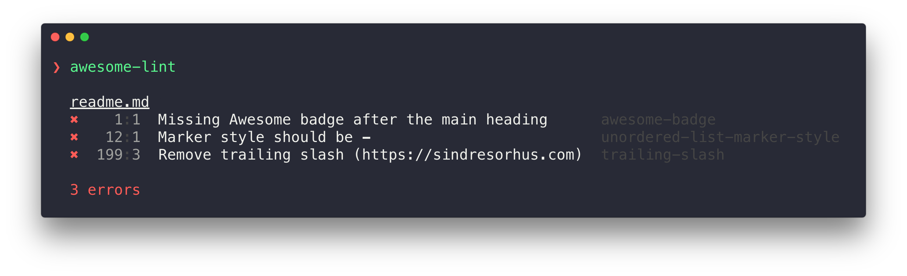

<h1 align="center">
	<br>
	
	<br>
	<br>
	<br>
</h1>

> Linter for [Awesome](https://awesome.re) lists

Intended to make it easier to create and maintain Awesome lists.

Includes a bunch of [general Markdown rules](config.js) and some [Awesome specific rules](rules).



## CLI

### Usage

The CLI requires Node.js and Git.

Type the command `npx awesome-lint` followed by the URL of the repo you want to check:

```
❯ npx awesome-lint https://github.com/sindresorhus/awesome-something

  readme.md:1:1
  ✖    1:1  Missing Awesome badge after the main heading      awesome-badge
  ✖   12:1  Marker style should be -                          unordered-list-marker-style
  ✖  199:3  Remove trailing slash (https://sindresorhus.com)  trailing-slash

  3 errors
```

### Special comments

You can enable, disable, and ignore rules using special comments. This is based on [remark-message-control](https://github.com/remarkjs/remark-message-control#markers).

By default, all rules are turned on. For example, 2 errors of `awesome-list-item` will be generated for following code snippets.

```md
- [foo](https://foo.com) - an invalid description.
- [foo](https://foo.com) - invalid description.
```

###### `disable`

The `disable` keyword turns off all messages of the given rule identifiers. If no identifiers are specified, all messages are turned off.

**Don't leave spaces after the last rule identifier.**

For example, when `awesome-list-item` is disabled, no errors are reported:

```md
<!--lint disable awesome-list-item-->
- [foo](https://foo.com) - an invalid description.
- [foo](https://foo.com) - invalid description.
```

###### `enable`

The `enable` keyword turns on all messages of the given rule identifiers. If no identifiers are specified, all messages are turned on.

For example, only the second line reports a `awesome-list-item` rule violation:

```md
<!--lint disable awesome-list-item-->
- [foo](https://foo.com) - an invalid description.
<!--lint enable awesome-list-item-->
- [foo](https://foo.com) - invalid description.
```

###### `ignore`

The `ignore` keyword turns off all messages of the given rule identifiers occurring in the following node. If no identifiers are specified, all messages are turned ignored. After the end of the following node, messages are turned on again. This is the main difference with `disable`.

For example, to turn off certain messages for the next node:

```md
<!--lint ignore awesome-list-item-->
- [foo](https://foo.com) - an invalid description.

List items share the same parent node. So let's create a new list.

- [foo](https://foo.com) - invalid description.
```

### Continuous Integration

#### GitHub Actions

You can use [GitHub Actions](https://github.com/features/actions) for free to automatically run `awesome-lint` against all pull requests.

Create `/.github/workflows/main.yml` with the following contents:

```yml
name: CI
on:
  pull_request:
    branches: [main]
jobs:
  Awesome_Lint:
    runs-on: ubuntu-latest
    steps:
      - uses: actions/checkout@v4
        with:
          fetch-depth: 0
      - run: npx awesome-lint
```

*`fetch-depth: 0`* is needed so that we can check the repo age.

You may add [branch protection rules](https://docs.github.com/en/github/administering-a-repository/configuring-protected-branches) to prevent merging branches not passing `awesome-lint`.

#### Pre-commit

You can use [pre-commit](https://pre-commit.com) to run `awesome-lint` as a Git pre-commit hook.

Add this to your `.pre-commit-config.yaml`:

```yaml
repos:
  - repo: https://github.com/sindresorhus/awesome-lint
    rev: v2.1.2  # Use the latest version
    hooks:
      - id: awesome-lint
```

Then run `pre-commit install` to set up the Git hook.

## API

### Install

```sh
npm install awesome-lint
```

### Usage

```js
import awesomeLint from 'awesome-lint';

// Lint the current directory's readme.md
await awesomeLint.report();

// Lint a specific file
await awesomeLint.report({filename: 'my-awesome-list.md'});

// Lint a GitHub repository
await awesomeLint.report({filename: 'https://github.com/sindresorhus/awesome'});

// Get raw results without console output
const files = await awesomeLint();
```

### API

#### awesomeLint(options?)

Returns a `Promise` for an array of [`VFile`](https://github.com/vfile/vfile) objects containing lint results.

##### options

Type: `object`

###### filename

Type: `string`
Default: `'readme.md'`

Path to the file to lint, or a GitHub repository URL.

###### config

Type: `Array`
Default: `config` (from `config.js`)

Custom remark plugins configuration.

#### awesomeLint.report(options?)

Lint and display results to the console. Returns a `Promise` that resolves when linting is complete.

Takes the same options as `awesomeLint()`, plus:

##### options.reporter

Type: `Function`

Custom reporter function to format the output.
